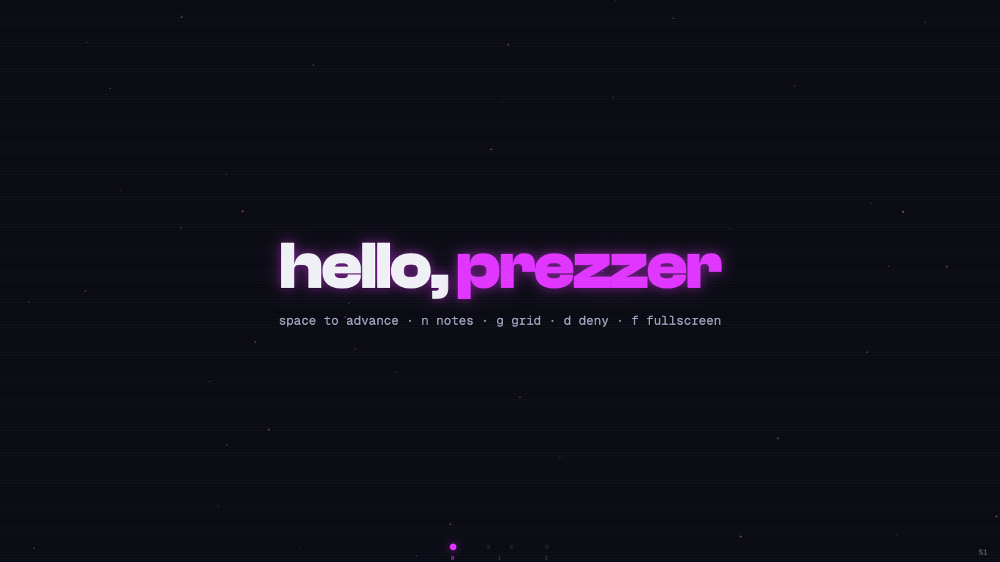
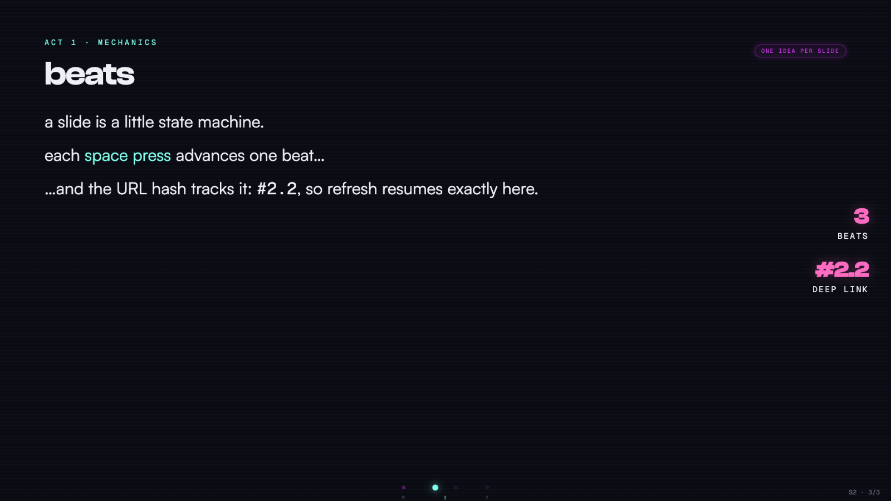
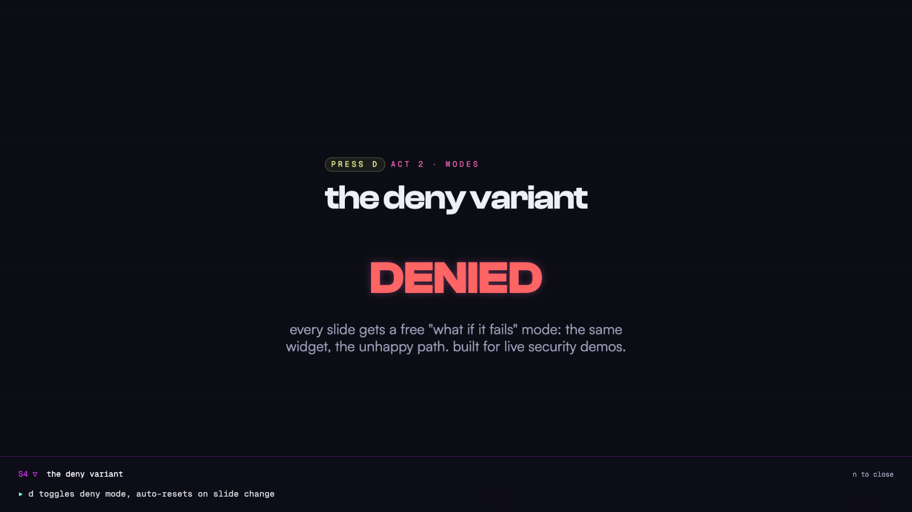

<h1 align="center">
  🎭 Prezzer
</h1>

<p align="center">
  <strong>Cinematic presentations as code — Bun-native, React-powered, one offline HTML file.</strong>
</p>

<p align="center">
  <a href="https://github.com/hyperb1iss/prezzer/actions/workflows/ci.yml">
    
  </a>
  <a href="https://www.npmjs.com/package/prezzer">
    
  </a>
  <a href="https://www.npmjs.com/package/create-prezzer">
    
  </a>
  <a href="https://github.com/hyperb1iss/prezzer/blob/main/LICENSE">
    
  </a>
</p>

<p align="center">
  <a href="https://bun.sh">
    
  </a>
  <a href="https://react.dev">
    
  </a>
  <a href="https://www.typescriptlang.org">
    
  </a>
</p>

<p align="center">
  <a href="https://hyperb1iss.github.io/prezzer/">🎭 Live Demo</a> •
  <a href="#-quick-start">Quick Start</a> •
  <a href="#-agent-fast-path">Agents</a> •
  <a href="#-slides-are-components">Slides as Code</a> •
  <a href="#-present-like-you-mean-it">Presenting</a> •
  <a href="#-one-file-fully-offline">The Artifact</a> •
  <a href="#-themes-and-motion">Theming</a> •
  <a href="#-packages">Packages</a>
</p>

<p align="center">
  
</p>

A Prezzer deck is real software. It lives in its own repository, renders with real React components, and builds to a single HTML file you can present from `file://`, attach to an email, or drop on any static host. No cloud, no export pipeline, no slide-shaped WYSIWYG — just code that performs.

**See it live:** the [demo deck](https://hyperb1iss.github.io/prezzer/) is Prezzer presenting itself — every claim on screen is the engine running, baked by CI into the exact one-file artifact it describes.

## ✨ Features

- 🎬 **Beat-driven slides** — every slide is a little state machine; each press of space reveals the next beat of the story
- ⚡ **Bun-native end to end** — one runtime for the dev server, Tailwind, TypeScript, tests, and the build
- 📦 **One-file offline artifact** — `prezzer build` bakes markup, styles, scripts, images, and self-hosted fonts into a single HTML file
- 🎭 **Presenter chrome built in** — speaker notes, grid overview, act-aware progress rail, and honest rollout badges
- 💫 **Eight slide transitions** — `portal`, `glitch`, `zoom`, `rise`, `spiral`, `morph`, `split`, and `slide`, chosen per slide
- 🔗 **Hash deep links** — `#4.2` reopens slide four mid-reveal; refresh resumes exactly where you were
- 🧨 **Deny mode** — one keypress flips slides that read `useDenyMode()` into their authored failure-path variant, made for live security demos
- 🖱️ **Keyboard, touch, and widgets** — all three advance through the same ordering guarantees, and self-timed demos can claim the spacebar before the deck moves
- 🌌 **SilkCircuit theme** — electric purple and neon cyan out of the box, fully overridable through design tokens
- ♿ **Accessibility that ships** — reduced-motion support, unrevealed beats stay out of the accessibility tree, focus-visible styling everywhere

## ⚡ Quick Start

```bash
bun create prezzer my-talk
cd my-talk
bun dev
```

That is the entire development setup. `bun dev` runs the Prezzer dev server — hot reload for React and TypeScript, Tailwind through Bun's native plugin, and `public/` assets served in dev. The bake inlines only assets referenced by literal paths, and warns when one isn't.

When the deck is ready:

```bash
bun run check
bun run build
```

`dist/index.html` contains the complete presentation — open it from `file://`, attach it to an email, or put it on any static host.

## 🤖 Agent Fast Path

Building with Claude Code or another coding agent? One command teaches it the whole system — the authoring workflow, the full API reference, and the gotchas we hit so your agent doesn't have to:

```bash
npx skills add hyperb1iss/prezzer
```

No installer handy? Paste [skills/prezzer/SKILL.md](skills/prezzer/SKILL.md) at your agent — it links everything else it needs.

## 🎬 Slides Are Components

```tsx
import { Beat, Deck, type SlideDef } from "prezzer";
import "prezzer/styles.css";

function Thesis() {
  return (
    <main>
      <h1>context is the product</h1>
      <Beat at={1}>retrieval decides what the model can become.</Beat>
    </main>
  );
}

const slides: SlideDef[] = [
  {
    id: "S1",
    title: "the thesis",
    beats: 2,
    notes: ["pause before the reveal"],
    component: Thesis,
  },
];

export function Talk() {
  return <Deck slides={slides} />;
}
```

`<Beat at={n}>` gates content on the slide's current beat, and `useBeat()` drives diagrams, counters, and any scene whose whole state changes together. Slides group into acts that color the progress rail and grid overview.

<p align="center">
  
</p>

## 🎪 Present Like You Mean It

| Key                  | Action                              |
| -------------------- | ----------------------------------- |
| `space`, `→`, `pgdn` | next beat, widget, or slide         |
| `←`, `pgup`          | previous beat or slide              |
| `shift` + arrow      | skip a whole slide                  |
| `1`–`9`              | jump straight to a slide            |
| `home`, `end`        | first or last slide                 |
| `g`                  | grid overview                       |
| `n`                  | speaker notes                       |
| `f`                  | fullscreen                          |
| `d`                  | deny mode for failure-path demos    |
| `a`                  | fire the autoplay signal to widgets |
| `?`                  | shortcut help overlay               |

Page up and page down mean presenter clickers work out of the box.

Touch works everywhere the keyboard does: swipe to navigate, tap the edges to step, tap the center to advance. Imperative widgets register with the deck and claim the next advance before the slide moves on — live demos run on your cue, not on a timer.

<p align="center">
  
</p>

## 📦 One File, Fully Offline

```bash
prezzer build
```

```
prezzer baking index.html
✓ dist/index.html · 361.0 KB · 235ms · one file, works offline
```

The build compiles the deck with Bun's browser bundler and inlines every referenced `public/` asset — images and self-hosted fonts included — as data URIs. The file needs no server and keeps presenting when the network disappears: the starter's CDN display fonts fall back to system type offline, and [self-hosting them](docs/deck-authoring.md#fonts) bakes the full typography into the artifact for true airplane mode.

## 🌌 Themes and Motion

Prezzer ships the SilkCircuit design language by default: deep-space blacks, electric purple, neon cyan, and glow tokens tuned to survive washed-out projectors. Override only what your talk needs:

```tsx
import { createTheme, Deck } from "prezzer";

const theme = createTheme({
  colors: { electricPurple: "#b14cff", background: "#08060f" },
});

<Deck slides={slides} theme={theme} />;
```

Components read the active theme with `useDeckTheme()`, and every token doubles as a `--prezzer-*` CSS custom property. Motion is physics-based — spring presets and reveal variants live in `prezzer/motion`, and every transition respects `prefers-reduced-motion`.

## 🧩 Packages

| Package                                     | What it does                                                                                                                  |
| ------------------------------------------- | ----------------------------------------------------------------------------------------------------------------------------- |
| [`prezzer`](packages/engine)                | The React engine: deck shell, presenter chrome, theme tokens, motion primitives, widget registry, and the `prezzer build` CLI |
| [`create-prezzer`](packages/create-prezzer) | Powers `bun create prezzer` and owns the starter deck                                                                         |
| [`examples/hello`](examples/hello)          | The reference deck — exercises the published package boundary and the complete build path                                     |
| [`examples/demo`](examples/demo)            | The showcase deck — Prezzer presenting itself, deployed to [GitHub Pages](https://hyperb1iss.github.io/prezzer/) by CI        |

The built-in chrome is framework-free CSS. Decks can use Tailwind, vanilla CSS, CSS modules, or any other styling approach without changing the engine.

## 📚 Learn the System

- [Deck authoring](docs/deck-authoring.md) — slides, acts, beats, widgets, themes, and fonts
- [Engine package](packages/engine/README.md) — entry points and the build CLI
- [Scaffolder package](packages/create-prezzer/README.md) — `bun create prezzer` options
- [Release process](docs/releasing.md) — trusted publishing via GitHub OIDC
- [Security policy](SECURITY.md)

## 💜 Contributing

```bash
bun install
bun run check
bun run build
```

A clean clone needs Bun and those three commands — that's the whole contributor setup. Read the [contributing guide](CONTRIBUTING.md) for the development loop and change-shape expectations.

## 📄 License

Prezzer is licensed under the MIT License. See [LICENSE](LICENSE) for details.

---

<div align="center">

Created by [Stefanie Jane 🌠](https://github.com/hyperb1iss)

If Prezzer makes your talks electric, [buy me a Monster Ultra Violet](https://ko-fi.com/hyperb1iss)! ⚡

</div>

<p align="center">
  <a href="https://github.com/hyperb1iss">
    
  </a>
  <a href="https://bsky.app/profile/hyperbliss.tech">
    
  </a>
</p>
